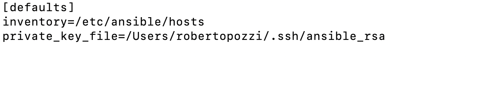

# Raspberry Pi automation
- [Introduction](#introduction)
- [Ansible configuration setup](#Ansible-configuration-setup)
- [Installation automation task](#Installation-automation-task)
    - [Basic web infrastructure installation automation task](#Basic-web-infrastructure-installation-automation-task)
    - [Docker installation automation task](#Docker-installation-automation-task)
- [Projects](#projects)
    - [Home Automation](#home-automation)
- [References](#References)

## Introduction
This repository holds scripts, playbooks and configurations to automate infrastructure configuration tasks on Raspberry Pi boards.

## Ansible configuration setup
The scripts provided are based on Ansible technology (https://www.ansible.com/) for task automation; refer to Ansible technical 
documentation (https://docs.ansible.com/) for detailed instructions regarding installation and setup.

Ansible uses ssh to connect to the managed infrastructure, so you will first need to generate an ssh key pair; the script *[ansible-initialize.sh](ansible-initialize.sh)*, provided in the root folder of this repo, copies the public ssh key to a remote destination (you will need to pass it as a parameter when you launch the script), assuming you generated a key called *ansible_rsa* and saved it in *.ssh* sub-folder under your user home directory.

A file, named *[ansible.cfg](ansible.cfg)*, is also provided to set basic configurations needed to run Ansible; if you launch Ansible from the repo root directory, this file will be read and used as the source for configuration settings (unless you have set an ANSIBLE_CONFIG environment variable, which has precedence), the basic configuration you should have is something like this:

where:

* *inventory* defines where Ansible will look for the inventory file, which is used by Ansible to know which servers to connect and manage.
* *private_key_file* points to the SSH private key you have previously generated, used by Ansible to connect and launch tasks on the target Raspberry Pi;

Change the parameters according to your environment.

## Installation automation task
The **[raspberry.yaml](raspberry.yaml)** playbook is provided to do the following basic tasks on all Raspberry boxes consistently:

    * update package manager repo cache and upgrade installed packages on all Raspberry Pi boxes
    * install OpenSSL on all Raspberry Pi boxes

A convenient scripts is provided:
* **[install.sh](install.sh)** uses *[raspberry.yaml](raspberry.yaml)* playbook to consistently configure Raspberry Pi boxes 

Playbook refers to **[config.yml](conf/config.yml)** yaml file provided in *[conf](conf)* sub-folder for common variables setup and usage.

### Basic web infrastructure installation automation task
A very basic infrastructure to run web applications can be made of two major components:

* a Web Server where web application code is actually deployed and is run from - this can be implemented using **Apache2**
* a Proxy server that intercepts user requests and forward to the the Web Server, which actually serves the content back to the user - this can be implemented using **Nginx**

The **[raspberry-web.yaml](web/raspberry-web.yaml)** playbook is provided under *[web](web/)* sub-folder to deploy this basic web infrastructure by doing the following basic tasks on all Raspberry boxes consistently:

    * update package manager repo cache and upgrade installed packages on all Raspberry Pi boxes
    * install OpenSSL on all Raspberry Pi boxes
    * install Nginx on Raspberry Pi boxes marked as proxies and copy utility scripts for Nginx (provided in the *scripts* sub-folder)
    * install Apache2 on Raspberry Pi boxes marked as application servers and copy utility scripts for Apache2 (provided in the *scripts* sub-folder)

Some convenient scripts are provided under *[web](web/)* sub-folder::
* **[install-web.sh](web/install-web.sh)** uses *[raspberry-web.yaml](web/raspberry-web.yaml)* playbook to install Nginx and Apache2 on dedicated Raspberry Pi boxes consistently
* **[uninstall-web.sh](web/uninstall-web.sh)** uses *[raspberry-web-uninstall.yaml](web/raspberry-web-uninstall.yaml)* playbook to uninstall custom software from all Raspberry Pi boxes.

### Docker installation automation task
To automate Docker installation on Raspberry Pi boxes using Ansible: follow instructions at https://www.rs-online.com/designspark/raspberry-pi-4-personal-datacentre-part-1-ansible-docker-and-nextcloud.

General instructions on how to install and uninstall Docker on Raspberry Pi boxes are available at https://phoenixnap.com/kb/docker-on-raspberry-pi.

The **[raspberry-docker.yaml](docker/raspberry-docker.yaml)** playbook is provided under *[docker](docker/)* sub-folder to install Docker on all Raspberry Pi boxes.

Some convenient scripts are provided under *[docker](docker/)* sub-folder:
* **[install-docker-role.sh](docker/install-docker-role.sh)**, which installs *geerlingguy.docker_arm* role (see Ansible Galaxy https://galaxy.ansible.com/geerlingguy/docker_arm and GitHub Repo https://github.com/geerlingguy/ansible-role-docker_arm for more info) that installs Docker on Linux, specially tailored for ARM-based computers like the Raspberry Pi.
* **[install-docker.sh](docker/install-docker.sh)** uses *[raspberry-docker.yaml](docker/raspberry-docker.yaml)* playbook to activate a Docker role on all Raspberry boxes 
* **[uninstall-docker.sh](docker/uninstall-docker.sh)** uses *[raspberry-docker-uninstall.yaml](docker/raspberry-docker-uninstall.yaml)* playbook to uninstall Docker from all Raspberry Pi boxes.

## Projects
I use Raspberry in some projects I develop for fun.

### Home Automation
This is a side project that I am developing to handle sensors for various Home Automation tasks; see https://github.com/robipozzi/windfire-home-automation

## References
I wrote a more extensive article on how to use Ansible to automate various installation, configuration and application deployment tasks on Raspberry Pi, you can read it at the link here *https://bit.ly/3b13V9h*.